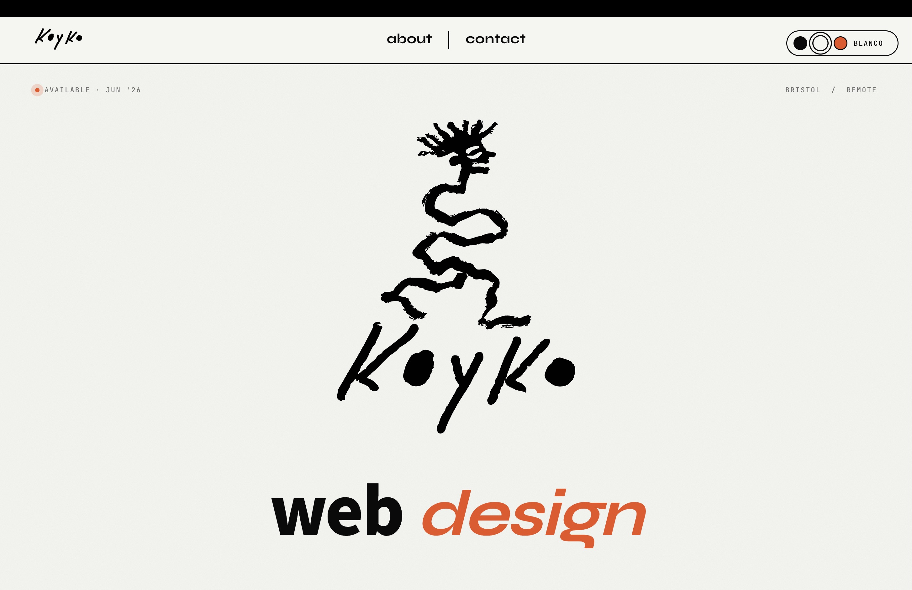

# Koyko Design

A personal portfolio and client-facing website for Koyko Design — a solo web design and development practice based in Bristol, UK. The site functions as both a showcase of bespoke projects and a selling platform for custom-coded websites aimed at creatives, small businesses, and startups.



🌐 [koykodesign.com](https://koykodesign.com)

---

## Table of Contents

- [About](#about)
- [Design & Planning](#design--planning)
- [Features](#features)
- [Studio Hub (internal)](#studio-hub-internal)
- [Technologies Used](#technologies-used)
- [Project Structure](#project-structure)
- [Deployment](#deployment)
- [Environment Variables](#environment-variables)
- [Local Development](#local-development)
- [Credits](#credits)

---

## About

Koyko is drawn from Mapudungun — the language of the Mapuche people — where it means *water*. The metaphor runs through the brand: fluid, clear, always finding its form. Every site built under this name is custom-coded, performant, and fully owned by the client — no subscriptions, no page builders.

The site itself is a live demonstration of that philosophy: minimal, typographically precise, and driven by scroll-triggered animation. The current public site is the "V2" design — a theme-able, hand-drawn brand system — and it ships alongside a private internal dashboard, the [Studio Hub](#studio-hub-internal), used to run the business day-to-day.

---

## Design & Planning

### Design Philosophy

- Minimal and functional — no visual clutter, every element earns its place
- Typographically led — hand-drawn marks paired with a strong type hierarchy
- Interaction as identity — motion is not decorative, it communicates
- Theme-able canvas — the visitor can switch the whole site between three palettes

### Colour Scheme

The V2 brand runs on a small token set, swapped live by the theme picker:

| Role | Value |
|---|---|
| Paper / background (`blanco`, default) | `#F5F5F0` |
| Ink / text | `#111111` |
| Signal accent (`naranjo`) | `#EB5120` (orange — headers, accents, active states) |
| Dark canvas (`negro`) | `#0A0A0A` |
| Mission highlight | `#79FF4F` (vivid green — Mission scroll animation) |

The theme picker (`V2ThemePicker` + `useV2Theme`) persists the choice to `localStorage`, so picking a palette on one page carries across the whole site.

### Typography

Fonts are self-hosted with `next/font/google` and exposed as CSS variables:

| Font | Role | CSS variable |
|---|---|---|
| Syne | Display / headings | `--font-syne` |
| Noto Sans JP | Body / weighted text | `--font-noto-sans-jp` |
| JetBrains Mono | Mono / labels & UI | `--font-jetbrains-mono` |

---

## Features

### Landing Page — Animated Counter Entrance

On first load (`/`), `LandingPageV2` plays a GSAP-driven counter/"drop" animation. Clicking anywhere — or the explicit **Enter site** link — navigates to `/home`.

### Home (`/home`)

The main experience, composed of V2 sections: a custom cursor (`KoykoCursorV2`), the theme picker, hero, a horizontally scrolling features marquee (`KoykoMarqueeV2`), portfolio, a "designed with love" section, contact, and footer.

### Mission Section — Physics-Driven Scroll Animation (`/about`)

The brand story paragraph is split word-by-word. As the user scrolls through a tall sticky section, GSAP ScrollTrigger drives four phases:

1. **Fade in** — words appear in random stagger order
2. **Highlight** — key words turn vivid green (`#79FF4F`)
3. **Physics crumble** — highlighted words detach and fall using Matter.js gravity
4. **Wind blast** — fallen words are swept off-screen

### Case Studies (`/casestudies` + `/casestudies/[id]`)

A listing of selected client and personal work (`KoykoStudiesV2`), with a dynamic route for each individual case study.

### Process (`/process`)

A walkthrough of how Koyko takes a project from idea to launch (`KoykoProcessV2`).

### FAQs (`/faqs`)

Common questions about working with Koyko, including pricing/packages guidance (`KoykoFAQsV2`).

### Contact Page & API Route (`/contact`)

A controlled contact form (`KoykoContactFormV2`) POSTs to the Next.js API route `/api/contact`. The handler validates input server-side, checks the email format, and forwards the enquiry via **Resend** — sending to `CONTACT_EMAIL` with `replyTo` set to the visitor's address so a reply in the inbox goes straight back to them. The form shows a loading state during the request and a personalised thank-you message on success.

### Navbar & Footer

`KoykoNavbarV2` links to the site's sections and carries the theme toggle; `KoykoFooterV2` closes each page.

---

## Studio Hub (internal)

`/studio-hub` is a **private, `noindex`, URL-only dashboard** used to run the studio. It's gated behind a single password (`POST /api/studio-hub/login`) that sets a signed (HMAC-SHA256) httpOnly cookie; every `/api/studio-hub` call re-verifies it.

All state lives in **one row of Neon Postgres** as JSONB blobs (read/written as a single object via `GET`/`PUT /api/studio-hub`), organised into area tabs:

- **Dashboard** — overview tiles + a weekly task board with per-task timers, a weekly completion report, and "Plan Marea" (a recurring weekly checklist that auto-seeds itself).
- **Sales** — a Leads CRM kanban (New → Email Sent → Contacted → Proposal → Negotiation → Won/Lost), with a 3-day auto follow-up clock and a "due follow-ups" filter.
- **Clients** — a project kanban whose columns are delivery stages (discovery → design → dev → launch → live), with a Care Plan flag.
- **Marketing / Admin** — simple standing checklists.

> The Studio Hub is internal tooling, not part of the public marketing site. It requires the `DATABASE_URL`, `STUDIO_HUB_PASSWORD`, and `STUDIO_HUB_SECRET` environment variables (see below).

---

## Technologies Used

- **Next.js 15** (App Router) — React framework with file-based routing and API routes
- **React 18** — component-based UI
- **TypeScript** — used across the Studio Hub and API routes (the public site is mixed JS/TS)
- **GSAP 3** + **ScrollTrigger** — scroll-driven and timeline animations
- **Matter.js** — 2D physics engine for the Mission section word crumble
- **Resend** — transactional email API for the contact form
- **Neon** (`@neondatabase/serverless`) — serverless Postgres backing the Studio Hub
- **Netlify** — deployment and hosting

---

## Project Structure

```
koyko-web-next/
├── public/
│   └── assets/
│       ├── anim/                       # Animation assets
│       └── images/                     # Logo, favicon, screenshots (incl. readme/)
├── scripts/
│   └── print-qr.js                     # Prints a dev-server QR code to the terminal
├── src/
│   ├── app/                            # Next.js App Router
│   │   ├── layout.jsx                  # Root layout — fonts, metadata, analytics
│   │   ├── page.jsx                    # /            → LandingPageV2
│   │   ├── home/page.jsx               # /home        → HomeV2
│   │   ├── about/page.jsx              # /about       → AboutV2 (Mission animation)
│   │   ├── process/page.jsx            # /process     → ProcessV2
│   │   ├── casestudies/page.jsx        # /casestudies → CaseStudiesV2
│   │   ├── casestudies/[id]/page.jsx   # /casestudies/:id → single case study
│   │   ├── faqs/page.jsx               # /faqs        → FAQsV2
│   │   ├── contact/page.jsx            # /contact     → ContactV2
│   │   ├── studio-hub/                 # Private internal dashboard (.tsx)
│   │   │   ├── page.tsx                # Tabbed hub (Dashboard/Sales/Clients/…)
│   │   │   ├── StudioLeads.tsx         # Sales CRM kanban
│   │   │   ├── StudioClients.tsx       # Clients project kanban
│   │   │   ├── StudioTodos.tsx         # Marketing/Admin checklists
│   │   │   └── studio-hub.module.css
│   │   └── api/
│   │       ├── contact/route.js        # POST → Resend email
│   │       └── studio-hub/             # GET/PUT state + login (signed cookie)
│   ├── assets/
│   │   ├── anim/                       # GSAP animation helpers
│   │   ├── css/style.css               # Global styles + brand tokens
│   │   └── koykoAssets.js              # Shared image path constants
│   ├── components/
│   │   └── v2/                         # Current site components (KoykoNavbarV2, …)
│   │       ├── KoykoNavbarV2.jsx  KoykoHeroV2.jsx  KoykoMarqueeV2.jsx
│   │       ├── KoykoPortfolioV2.jsx  KoykoDesignedV2.jsx  KoykoMissionV2.jsx
│   │       ├── KoykoProcessV2.jsx  KoykoStudiesV2.jsx  KoykoFAQsV2.jsx
│   │       ├── KoykoContactV2.jsx  KoykoContactFormV2.jsx  KoykoFooterV2.jsx
│   │       ├── KoykoCursorV2.jsx  V2ThemePicker.jsx  useV2Theme.js
│   ├── lib/
│   │   └── studio-hub/                 # auth.ts, db.ts (Neon), schema.sql
│   └── views/                          # Page-level views (V2)
│       ├── LandingPageV2.jsx  HomeV2.jsx  AboutV2.jsx  ProcessV2.jsx
│       └── CaseStudiesV2.jsx  FAQsV2.jsx  ContactV2.jsx
├── package.json
└── next.config.js
```

---

## Deployment

The project is deployed on **Netlify** via the GitHub integration (`ValentinoFarias/koyko_design`, `main` branch).

1. Push to `main` — Netlify detects the Next.js project and builds it with the Next.js Runtime automatically
2. Set environment variables in the Netlify dashboard (see below)
3. Custom domain configured via Namecheap → Netlify DNS

---

## Environment Variables

Create a `.env.local` file at the project root for local development:

```
# Contact form (Resend)
RESEND_API_KEY=re_xxxxxxxxxxxxxxxxxxxx
CONTACT_EMAIL=you@example.com

# Studio Hub (private dashboard)
DATABASE_URL=postgres://...        # Neon connection string
STUDIO_HUB_PASSWORD=your-password  # password to unlock /studio-hub
STUDIO_HUB_SECRET=long-random-hex  # used to sign the auth cookie
```

In production, add these under the Netlify site's **Site configuration → Environment variables**.

> The contact form (`/api/contact`) returns a 500 if `RESEND_API_KEY` or `CONTACT_EMAIL` is missing. The Studio Hub API throws if `DATABASE_URL`, `STUDIO_HUB_PASSWORD`, or `STUDIO_HUB_SECRET` is missing.

---

## Local Development

```bash
# Install dependencies
npm install

# Start dev server (clears .next-dev cache, prints a QR code for mobile testing)
npm run dev

# Fast start — no cache clear, no QR
npm run dev:fast

# Fresh start — clears cache without the QR helper
npm run dev:fresh

# Remove build caches
npm run clean

# Production build / start
npm run build
npm start
```

The Studio Hub features require the database/auth environment variables above; the public marketing site runs without them.

---

## Credits

- [GSAP by GreenSock](https://gsap.com) — animation engine and ScrollTrigger plugin
- [Matter.js](https://brm.io/matter-js/) — 2D physics engine
- [Resend](https://resend.com) — transactional email API
- [Neon](https://neon.tech) — serverless Postgres
- [Next.js Documentation](https://nextjs.org/docs) — App Router, API routes, TypeScript
- [Netlify](https://netlify.com) — deployment and hosting platform
