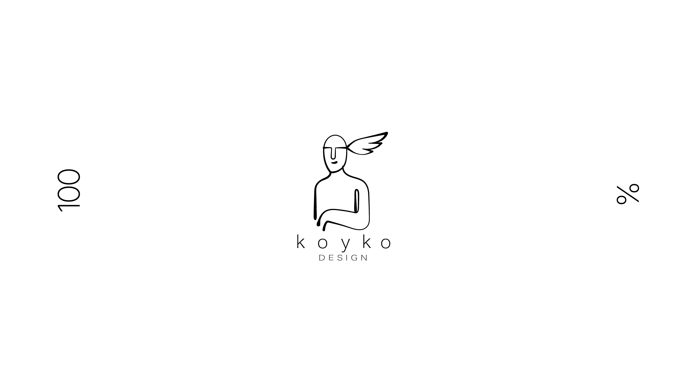

# Koyko Design

A personal portfolio and client-facing website for Koyko Design — a solo web design and development practice based in Bristol, UK. The site functions as both a showcase of bespoke projects and a selling platform for custom-coded websites aimed at creatives, small businesses, and startups.



🌐 [koykodesign.com](https://koykodesign.com)

---

## Table of Contents

- [About](#about)
- [Design & Planning](#design--planning)
- [Features](#features)
- [Technologies Used](#technologies-used)
- [Project Structure](#project-structure)
- [Deployment](#deployment)
- [Environment Variables](#environment-variables)
- [Local Development](#local-development)
- [Credits](#credits)

---

## About

Koyko is drawn from Mapudungun — the language of the Mapuche people — where it means *water*. The metaphor runs through the brand: fluid, clear, always finding its form. Every site built under this name is custom-coded, performant, and fully owned by the client — no subscriptions, no page builders.

The site itself is a live demonstration of that philosophy: minimal, typographically precise, and driven by scroll-triggered animation.

---

## Design & Planning

### Design Philosophy

- Minimal and functional — no visual clutter, every element earns its place
- Typographically led — spaced-out lettering, strong hierarchy
- Interaction as identity — motion is not decorative, it communicates
- White canvas with a dark mission section for contrast and rhythm

### Colour Scheme

| Role | Value |
|---|---|
| Background | `#ffffff` |
| Foreground / text | `#000000` |
| Highlight accent | `#79FF4F` (vivid green — Mission scroll animation) |
| Transition curtain | `#000000` |

### Typography

Fonts are mapped from the original Figma design:

| Figma font | Web equivalent | Weight |
|---|---|---|
| Hiragino Kaku Gothic Std W8 | Noto Sans JP | 800 |
| Hiragino Kaku Gothic ProN W3 | Noto Sans JP | 300 |
| Inter Regular | Inter | 400 |

---

## Features

### Landing Page — Animated Counter Entrance

On first load, a GSAP-driven counter animates from 0 → 100% while the Lottie logo plays in the centre of the screen. When the counter completes, a full-screen black curtain sweeps in (`scaleX` from left) and the router navigates to `/home`.

<!-- screenshot: landing counter at ~50%, Lottie logo visible -->

### Page Transitions

A `TransitionOverlay` component renders a fixed full-screen curtain div. GSAP animates `scaleX` on exit (`transformOrigin: left`) and on reveal (`transformOrigin: right`), creating a clean wipe between all routes. `TransitionRouterSync` keeps the overlay in sync with Next.js App Router navigation.

<!-- screenshot: transition curtain mid-wipe between pages -->

### Hero Section

Full-viewport hero featuring the Koyko wordmark and animated logo. Entry point to the main homepage experience.

<!-- screenshot: hero section — wordmark large, logo centred -->

### Mission Section — Physics-Driven Scroll Animation

The brand story paragraph is split word-by-word. As the user scrolls through a 400vh sticky section, four sequential animation phases play out driven by GSAP ScrollTrigger:

1. **Fade in** — words appear in random stagger order (0% → 33% scroll)
2. **Highlight** — key words turn vivid green (33% → 55%)
3. **Physics crumble** — highlighted words detach and fall using Matter.js gravity (~85%)
4. **Wind blast** — fallen words are swept off-screen (~97%)

<!-- screenshot: mission section mid-scroll — some words glowing green, others faded -->

### Features Ticker Strip

A horizontally scrolling marquee listing Koyko's core service offerings.

<!-- screenshot: features ticker strip -->

### Portfolio Section

Right-aligned project screenshot with supporting copy, showcasing selected client or personal work.

<!-- screenshot: portfolio section with project mockup -->

### Packages Page

Full breakdown of pricing tiers with a hosting plan comparison table:

| Plan | Price | Includes |
|---|---|---|
| Basic | £25 / month | Hosting + security updates |
| Care | £60 / month | Hosting + updates + 1 hr changes/month |
| Partner | £120 / month | Hosting + updates + 3 hrs changes/month |

<!-- screenshot: packages page with pricing tiers and hosting table -->

### Contact Page & API Route

A full contact form (Name, Email, Project type, Message) POSTs to the Next.js API route `/api/contact`. The handler validates input server-side and forwards the enquiry via **Resend**, with `replyTo` set to the visitor's address. The form shows a loading state during the request and a personalised thank-you message on success.

<!-- screenshot: contact form on /contact -->

### Navbar & Footer

Fixed frosted-glass navbar with spaced lettering linking to Packages and Contact. Footer includes logo, contact info, and a back-to-top link.

---

## Technologies Used

- **Next.js 15** (App Router) — React framework with file-based routing and API routes
- **React 18** — component-based UI
- **TypeScript** — type definitions for Node and React
- **GSAP 3** + **ScrollTrigger** — scroll-driven and timeline animations
- **Matter.js** — 2D physics engine for the Mission section word crumble
- **Resend** — transactional email API for the contact form
- **Lottie** (`@lottiefiles/lottie-player`) — JSON-based logo animation
- **Vercel** — deployment and hosting

---

## Project Structure

```
koyko-web-next/
├── public/
│   └── assets/
│       ├── anim/              # Lottie JSON animation files
│       └── images/            # Logo, favicon, avatars, project screenshots
├── src/
│   ├── app/                   # Next.js App Router
│   │   ├── layout.jsx         # Root layout — metadata, fonts, overlay components
│   │   ├── page.jsx           # / → LandingPage
│   │   ├── home/page.jsx      # /home → HomePage
│   │   ├── packages/page.jsx  # /packages → Packages
│   │   ├── contact/page.jsx   # /contact → Contact
│   │   └── api/contact/route.js  # POST handler — Resend email
│   ├── assets/
│   │   ├── anim/
│   │   │   └── pageTransitions.js  # GSAP curtain enter/exit animations
│   │   ├── css/
│   │   │   └── style.css           # Global styles
│   │   └── koykoAssets.js          # Shared image path constants
│   ├── components/            # Reusable UI components
│   │   ├── KoykoNavbar.jsx
│   │   ├── KoykoHero.jsx
│   │   ├── KoykoMission.jsx        # Physics + ScrollTrigger animation
│   │   ├── KoykoFeatures.jsx       # Scrolling ticker
│   │   ├── KoykoPortfolio.jsx
│   │   ├── KoykoDesigned.jsx
│   │   ├── KoykoContact.jsx
│   │   ├── KoykoContactForm.jsx    # Controlled form + fetch to /api/contact
│   │   ├── KoykoHosting.jsx        # Hosting plans table
│   │   ├── KoykoFooter.jsx
│   │   ├── TransitionLink.jsx
│   │   ├── TransitionOverlay.jsx   # Fixed curtain div
│   │   └── TransitionRouterSync.jsx
│   └── views/                 # Page-level view components
│       ├── LandingPage.jsx
│       ├── HomePage.jsx
│       ├── Packages.jsx
│       └── Contact.jsx
├── falling-text-demo.html     # Standalone prototype for the Mission animation
├── package.json
└── next.config.js
```

---

## Deployment

The project is deployed on **Vercel** via the GitHub integration (`ValentinoFarias/koyko_design`, `main` branch).

1. Push to `main` — Vercel detects the Next.js project and builds automatically
2. Set environment variables in the Vercel dashboard (see below)
3. Custom domain configured via Namecheap → Vercel DNS

---

## Environment Variables

Create a `.env.local` file at the project root for local development:

```
RESEND_API_KEY=re_xxxxxxxxxxxxxxxxxxxx
```

In production, add this in the Vercel project under **Settings → Environment Variables**.

> The contact form API route (`/api/contact`) will return a 500 error if this key is absent.

---

## Local Development

Node.js `>=20` is required (enforced by the Resend package).

```bash
# Install dependencies
npm install

# Start dev server (clears .next-dev cache)
npm run dev

# Fast start — no cache clear
npm run dev:fast

# Production build
npm run build

# Start production server
npm start
```

---

## Credits

- [GSAP by GreenSock](https://gsap.com) — animation engine and ScrollTrigger plugin
- [Matter.js](https://brm.io/matter-js/) — 2D physics engine
- [Resend](https://resend.com) — transactional email API
- [LottieFiles Web Player](https://lottiefiles.com/web-player) — JSON animation renderer
- [Next.js Documentation](https://nextjs.org/docs) — App Router, API routes, TypeScript
- [Vercel](https://vercel.com) — deployment platform
